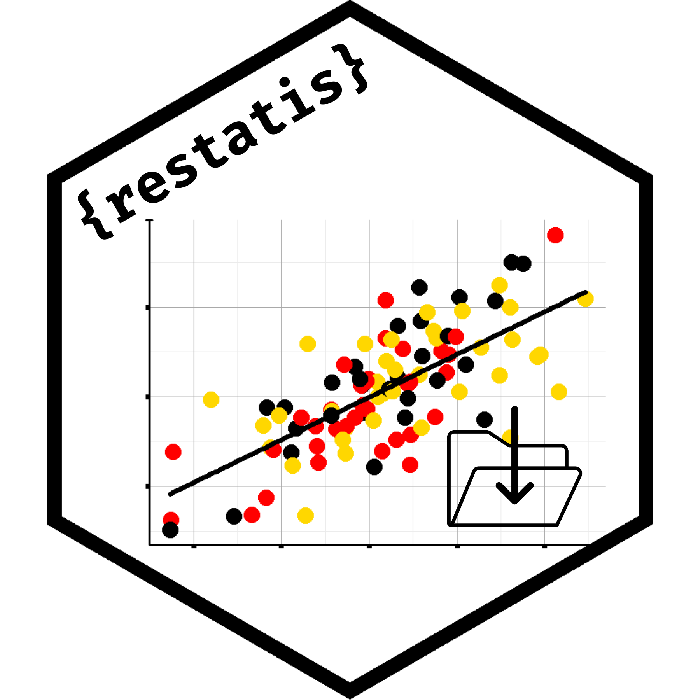

# restatis 

<!-- README.md is generated from README.Rmd. Please edit that file -->

**{restatis}** is a wrapper around the RESTful APIs that provide access
to the main databases of German official statistics:

- The [**GENESIS database** of the Federal Statistical Office of Germany
  (Destatis)](https://www-genesis.destatis.de/genesis/online)
- [**regionalstatistik.de**, which is the database of the German Länder
  (Regionaldatenbank)](https://www.regionalstatistik.de/genesis/online/)
- The [database of the **German 2022 Census** (Zensus
  2022)](https://ergebnisse.zensus2022.de/datenbank/online/)
- The [**Kommunale
  Bildungsdatenbank**](https://www.bildungsmonitoring.de/bildung/online/)
- The [**Landesdatenbank NRW**](https://www.landesdatenbank.nrw.de/)
- The [Datenbank des **Bayerischen Landesamtes für
  Statistik**](https://www.statistikdaten.bayern.de/genesis/online)
- The [Datenbank des **Statistischen Landesamtes
  Sachsen-Anhalt**](https://genesis.sachsen-anhalt.de/genesis/online)

Almost all functions work on either one of them, on all of them or just
on a selection.

`{restatis}` uses abbreviations in its functions to specify the
databases in the `database` parameter (e.g.,
`gen_table(name = "1234-0001", database = "regio")`). The respective
abbreviation strings are the following:

| Database                                               | Abbr.   |
|--------------------------------------------------------|---------|
| GENESIS (Federal Statistical Office of Germany)        | genesis |
| Regionaldatenbank (regionalstatistik.de)               | regio   |
| German Census 2022                                     | zensus  |
| Kommunale Bildungsdatenbank                            | bildung |
| Landesdatenbank NRW                                    | nrw     |
| Datenbank des Bayerischen Landesamtes für Statistik    | bayern  |
| Datenbank des Statistischen Landesamtes Sachsen-Anhalt | st      |

#### Current information and (known) issues

- It is unclear whether the databases of Sachsen-Anhalt (`st`), Bayern
  (`bayern`), Nordrhein-Westfalen (`nrw`) and Kommunales
  Bildungsmonitoring (`bildung`) support the creation of jobs. This is
  because it is sometimes hard to create large enough tables on a test
  basis. The package supports their creation and download for all
  databases mentioned, but there might be issues because of lack of
  tests.
- The CSV files currently returned by the `bayern` database (this
  affects `gen_table()`) appear to be slightly corrupted. This might
  cause warnings stemming from `{vroom}`. These can be ignored, but
  users have to carefully check the resulting `data.frames`. Use
  `vroom::problems()` to check the data objects for more information.
- At the moment, using `gen_cube()` and the latest version of `{vroom}`,
  there is a deprecation warning popping up that stems from our use of
  `{readr}` to use literal lines of CSVs. This does not affect the
  functionality of the function, so for now you can safely ignore it. We
  monitor whether there will be a change on `{readr}`’s side or will
  implement a fix with upcoming updates.

## Installation

You can install the released version of `{restatis}` from CRAN:

``` r
install.packages("restatis")
```

Or install a development version of `{restatis}` from
[GitHub](https://github.com/CorrelAid/restatis) with:

``` r
# install.packages("devtools")
devtools::install_github("CorrelAid/restatis")
```

## Usage

### Authentication

To access each one of the APIs, you need to have an account that you can
create on the homepage (see links to them above) and store your username
and password for use in R with `restatis::gen_auth_save()` (see
`?gen_auth_save` for more details).

#### API tokens

The GENESIS and Zensus 2022 databases do support authentication with an
API token as well. You can set the token as credential by using setting
the parameter `use_token = TRUE` for `restatis::gen_auth_save()`. The
token itself can be found when logging into the respective webpage with
your account and by clicking on *Webservice (API)* (EN) or
*Webservice-Schnittstelle (API)* (DE) in the bottom left corner.
**Important:** The GENESIS database will not let you create jobs when
using API tokens to authenticate. This is why `{restatis}` will check
your credential type once you set `job = TRUE` for `gen_table()` and
error in case a token is used. To enable the use of jobs, use
`gen_auth_save()` and input your username and password (by setting
`use_token = FALSE`).

#### Credentials as parameters

In the first versions of `{restatis}`, it was impossible to set the
credentials as a parameter. This is because we want to emphasise the
secure storage of credentials that is the default of the package.
However, we became aware of certain use-cases (e.g., automated piplines
via GitHub Actions and the like) that made it necessary to set the
credentials as a parameter. For this reason, in version 0.4.0 we
introduced the `credential_list` parameter for `{restatis}`’s functions.
Using this parameter, users can provide their credentials independently
of `gen_auth_save`. **Important Note:** *We do only encourage this in
very rare cases since it is advisable to safely store the credentials.
In case you use `credential_list`, always make sure that the credentials
do not appear anywhere in clear text!*

The `credentials_list` has to have the exact following structure:

``` r
custom_credentials <- list(genesis = c(username = 'abc123', password = 'qwerty1234'),
                           regio = c(username = 'abc123', password = 'qwerty1234'))
```

Now when using the custom credentials, you pass the list to the
respective function parameter (this overrides the credentials set by
`gen_auth_save()`):

``` r
# Example call with custom credentials
res <- restatis::gen_find(term = "diagnosen", 
                          database = "genesis", 
                          credential_list = custom_credentials)
                          
# This also works with multiple databases in `databases`
res2 <- restatis::gen_find(term = "krankenhäuser", 
                           database = c("genesis", "regio"),
                           credential_list = custom_credentials)                          
```

You have to make sure that the database(s) you specify in `database`
is/are listed in `credential_list`, otherwise the function call fails.
In some cases, you can specify the `error.ignore` parameter. If it is
set to `TRUE`, the function will continue to execute for those databases
that are available, even if some are not. **Note:** *`credentials_list`
does not (currently) support the use of API tokens.*

### Main features

`{restatis}` provides functions (prefixed with `gen_`) for finding,
exploring, and retrieving data from the three supported APIs.

In short, there are functions divided in two main parts, searching for
(meta)data and retrieving data:

#### Searching for (meta)data

- **gen_catalogue()**: Search the API’s catalogue of data
- **gen_find()**: Find objects related to a search term
- **gen_metadata()**: Find meta data to an objects
- **gen_alternative_terms()**: Find alternative terms to a search term
- **gen_modified_data()**: Find out when an object has last been
  modified
- **gen_objects2stat()**, **gen_objects2var()**, **gen_var2stat()**,
  **gen_val2var()**, **gen_val2var2stat()** and **gen_search_vars()**:
  Find objects, statistics, variables and values related to each other

#### Retrieving data

- **gen_cube()**: Using this function, you can download `cube` objects
- **gen_table()**: Using this function, you can download `table` objects
- **gen_list_jobs()** and **gen_download_job()**: Using this function,
  you can find and download previously created jobs (large tables)

#### Other functions

- **gen_logincheck()**: Perform a logincheck to test your credentials
- **gen_signs()**: Get a list of quality signs (special characters)
  found in the API’s tables
- **gen_update_evas()**: Manually scrape a newer version of the EVAS
  numbers (official statistic IDs)

### Caching

`{restatis}` uses [**memoisation**](https://github.com/r-lib/memoise) to
cache query results. This means that if you call a function multiple
times with the same exact input, the values returned the first time are
stored and reused from the second time on. Cached objects are stored in
memory and do not persist across R sessions. With version 0.3.0, we have
enabled users to turn off caching. The caching option is set to TRUE by
default and can be changed by setting
`options(restatis.use_cache = TRUE)` (or `FALSE`, respectively). You can
get the current state of the option by using
`getOption("restatis.use_cache")`. **Note:** Memoisation is *never* used
for the functions `gen_list_jobs()` and `gen_logincheck()` because there
is no use-case for a cached version of the results of these functions
(e.g., login checks should always be executed when called).

## Disclaimer

This package is in no way affiliated with the German Federal Statistical
Office (Destatis), the ‘Verbund Statistische Ämter des Bundes und der
Länder’ or any other API provider that the package offers services for.
It is a simple wrapper providing R functions to access different
official statistics APIs. The package authors are in no way responsible
for the data that can be retrieved using its functions and do not
provide support for any problems arising from the APIs’ functionality
itself. Conversely, support for problems related to this package is
**exclusively** provided by the package authors. The license of this
package solely applies to its source code.
